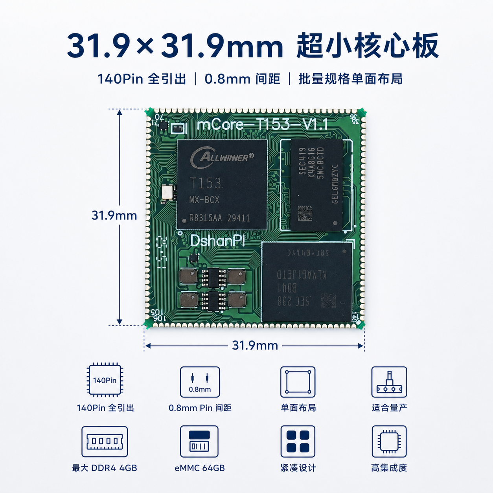
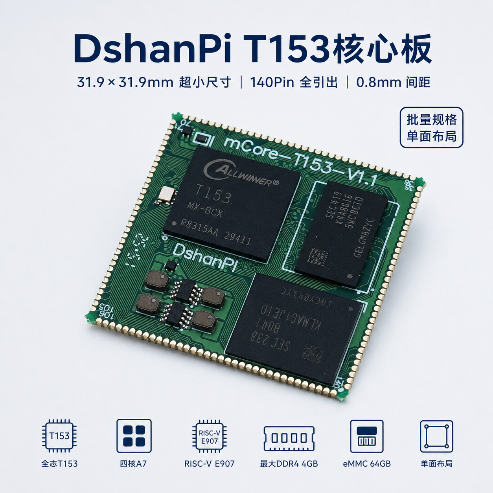
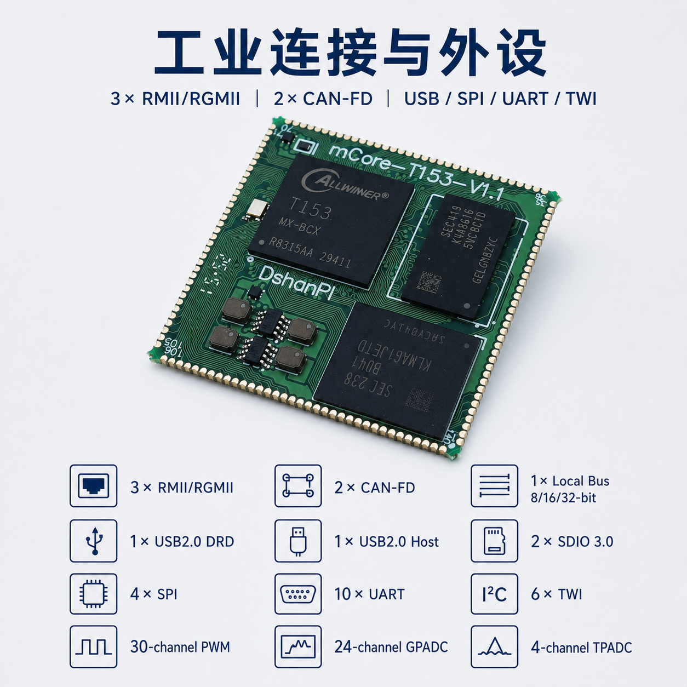

# T153MX-Tina5SDK_OmniGate

> Allwinner T153 (4× Cortex-A7) Tina Linux SDK — **OmniGate** 板级配置与开发工具 overlay 包。
> 本仓库是一个 **覆盖式差异备份（overlay package）**，包含对 T153 Tina SDK 的源码改动、板级配置、固件、AI 调试 skills 与工具，可一键应用到任意 T153 Tina SDK 工作树。

## 硬件概览

OmniGate 是基于全志 T153 SoC（4× Cortex-A7）的工业网关 / 异构控制板：

- **网络**：双 4G LTE + 双 RJ45 千兆以太网（RGMII）
- **总线**：2× CAN-FD + 2× RS485
- **无线**：Wi-Fi + Bluetooth（AIC8800D80，SDIO + UART）
- **音频**：PCM
- **显示**：RGB888（MIPI DSI ×4 + SPI1）
- **摄像头**：MIPI CSI1/2 ×4 lane

## 硬件实物图

### DshanPI-OminiGate


### mCore-T153MX





## 仓库结构

```
t153mx-ominigate-v1/
├── README.md                  本文档
├── LICENSE                    仓库许可证
├── .gitignore
├── images/                    硬件实物图
├── overlay/                   覆盖到 Tina SDK 工作树的差异文件
│   ├── bsp/                   驱动源码改动（aic8800_btlpm.c 等）
│   ├── buildroot/             buildroot defconfig 改动
│   ├── device/                T153 omnigate 板级配置（BoardConfig.mk / sys_config.fex /
│   │                          sys_partition.fex / dtbo / linux-5.10-origin / linux-5.10-rt / buildroot）
│   ├── platform/              aic8800 固件（sdio / aic8800d80）
│   ├── skills/                AI 辅助开发 skills（见下文）
│   └── tools/                 OpenixCLI 烧录工具 + serial_agent 串口代理
├── meta/                      overlay 元数据
│   ├── changed_files.tsv      实际新增/修改文件清单（相对 repo status）
│   ├── delete_list.txt        apply 时需要从 SDK 删除的旧固件清单
│   ├── repo_status.txt        `repo status` 原始输出
│   ├── repo_projects.txt      repo 项目列表
│   ├── summary.json           汇总统计
│   ├── skipped_files.tsv
│   └── errors.json
└── scripts/                   应用脚本
    ├── apply_overlay.sh       把 overlay/ 拷到目标 SDK 工作树
    └── apply_deletes.sh       按 meta/delete_list.txt 删除 SDK 中的旧文件
```

## 包含 / 排除

**包含**：`repo status` 中实际新增/修改的源码、配置、下载包、固件包；未追踪目录完整展开复制。

**排除**：`out/`、`bak/`、`project/`、`a133-tina-aidesktop/`、`tools/OpenixCLI/`（外链）、`tools/serial_agent/`（外链）、`prebuilt/rootfsbuilt/`、`.local_patch/`、编译缓存目录。

> 注意：`openwrt/target/` 和 `openwrt/openwrt/target/` 是源码配置目录，不按缓存排除。

## 使用方法

### 1. 应用 overlay 到现有 Tina SDK 工作树

```sh
# 假设 Tina SDK 在 /path/to/TinaSDK
/path/to/t153mx-ominigate-v1/scripts/apply_overlay.sh /path/to/TinaSDK
```

脚本会把 `overlay/` 下所有文件按相对路径 tar 拷贝到目标 SDK，**不执行任何删除动作**。

### 2. （可选）清理已被替换的旧固件

```sh
# 先人工审查清单
cat /path/to/t153mx-ominigate-v1/meta/delete_list.txt

# 确认无误后执行删除（脚本会要求输入 YES 二次确认）
/path/to/t153mx-ominigate-v1/scripts/apply_deletes.sh /path/to/TinaSDK
```

`delete_list.txt` 主要是 aic8800 旧版固件（已被 `*_u02.bin` 替代）。

### 3. 编译 / 烧录 / 串口调试

应用 overlay 后，按 T153 标准 Tina 流程：

```sh
# 在 SDK 根目录
source build/envsetup.sh
lunch t153_omnigate_mmc-buildroot
make && pack
```

烧录建议使用本仓库自带的 OpenixCLI：

```sh
sudo tools/OpenixCLI/openixcli scan -l
sudo tools/OpenixCLI/openixcli flash <image.img>
```

串口调试建议使用自带的 serial_agent（独占式串口代理，避免多人/多终端抢占 `/dev/ttyACM0`）：

```sh
cd tools/serial_agent
sudo python3 serial_agent_daemon.py --port /dev/ttyACM0 --baudrate 115200 --tcp-port 23334

# 另开终端实时查看
nc 127.0.0.1 23334
```

## AI Skills

`overlay/skills/` 下提供 5 个用于 Claude / Trae 等 AI Agent 的开发 skill：

| Skill | 用途 |
| --- | --- |
| `system-sdk-ai-default` | T153 SDK 默认 AI 开发闭环：清理配置 → 编译打包 → 烧录 → 串口验证 |
| `t153-flash-serial-debug` | 统一 T153 串口连接与固件烧录流程，含 FEL/USB 恢复步骤 |
| `t153-c906-heterogeneous-dev` | T153 A7 Linux + C906 RTOS 异构开发联调（remoteproc / RPMsg / amp_shell） |
| `t153-lvgl-ui-demo-dev` | 在 T153 上创建 / 交叉编译 / 烧写 / 验证 LVGL 界面示例 |
| `serial-agent-daemon` | T153 串口独占代理（single-owner）使用规范，避免串口抢占冲突 |

每个 skill 目录下的 `SKILL.md` 是触发条件 + 操作流程的完整说明，AI Agent 会按需调用。

## 工具

- **`tools/OpenixCLI/`** — 全志固件烧录 CLI（含 `openixcli` 二进制、deb 安装包、桌面启动器）
- **`tools/serial_agent/`** — Python 串口代理 daemon + client，支持 LangChain / CrewAI 工具集成，提供 TCP 透传端口供 `nc` 接入

## 元数据说明

`meta/` 目录用于记录 overlay 的生成上下文，方便回溯：

- `changed_files.tsv` — `repo status` 中所有 `M`/`??` 状态文件的清单（status + path）
- `delete_list.txt` — 需要从 SDK 删除的旧文件路径（一行一个，相对 SDK 根）
- `repo_status.txt` — 生成时的 `repo status` 原始输出
- `repo_projects.txt` — 生成时的 `repo project -l` 输出
- `summary.json` — overlay 文件数 / 删除条目数 / 排除规则等汇总

## 许可证

见 [LICENSE](./LICENSE)。

## 相关仓库

- 上游 Tina SDK：全志官方 Tina Linux V5.0
- OpenixCLI：<https://github.com/YuzukiTsuru/OpenixCLI>
